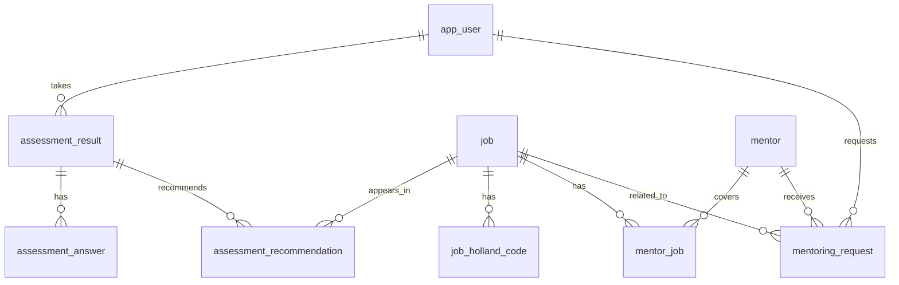

# CareerNet 데이터 구조 설계

## 설계 목표

CareerNet은 진로 탐색이 어려운 중고등학생, 대학생이 검사를 통해 자신에게 맞는 직업을 찾고, 해당 직업의 실무자를 멘토로 연결받는 서비스입니다.

따라서 데이터는 아래 흐름을 끊기지 않게 저장할 수 있어야 합니다.

```text
사용자
→ 진로 검사 응답
→ 검사 결과
→ 추천 직업
→ 직업 상세 정보
→ 직업과 연결된 멘토
→ 멘토 상세/추천/멘토링 신청
```

## 핵심 도메인

```text
User
Assessment
AssessmentAnswer
Job
JobHollandCode
AssessmentRecommendation
Mentor
MentorJob
MentoringRequest
```

## 테이블 관계 요약



## 1. 사용자

### app_user

서비스 사용자입니다. 학생, 일반 사용자, 관리자까지 확장할 수 있도록 `role`을 둡니다.

| 컬럼 | 타입 | 설명 |
| --- | --- | --- |
| user_id | BIGINT PK AUTO_INCREMENT | 사용자 고유 ID |
| email | VARCHAR(255) UNIQUE | 로그인 이메일 |
| password_hash | VARCHAR(255) | 암호화된 비밀번호 |
| name | VARCHAR(100) | 사용자 이름 |
| education_level | VARCHAR(50) | 중학생, 고등학생, 대학생 등 |
| interest | VARCHAR(100) | 관심 분야 |
| role | VARCHAR(20) | USER, ADMIN |
| created_at | DATETIME | 생성일 |
| updated_at | DATETIME | 수정일 |
| deleted_at | DATETIME NULL | 탈퇴/비활성 처리 |

## 2. 진로 검사

### assessment_result

사용자가 검사를 완료했을 때 생성되는 결과입니다.

`holland_code`, `primary_type`, 점수들을 저장하는 이유는 이후 직업 데이터가 바뀌어도 당시 검사 결과를 그대로 보여줄 수 있게 하기 위해서입니다.

| 컬럼 | 타입 | 설명 |
| --- | --- | --- |
| assessment_id | BIGINT PK AUTO_INCREMENT | 검사 결과 ID |
| user_id | BIGINT FK | 사용자 ID |
| assessment_type | VARCHAR(30) | HOLLAND, APTITUDE, VALUES, BIG5 |
| holland_code | VARCHAR(10) | 예: RIC |
| primary_type | VARCHAR(10) | 가장 높은 유형 |
| score_r | INT | R 원점수 |
| score_i | INT | I 원점수 |
| score_a | INT | A 원점수 |
| score_s | INT | S 원점수 |
| score_e | INT | E 원점수 |
| score_c | INT | C 원점수 |
| pct_r | INT | R 퍼센트 |
| pct_i | INT | I 퍼센트 |
| pct_a | INT | A 퍼센트 |
| pct_s | INT | S 퍼센트 |
| pct_e | INT | E 퍼센트 |
| pct_c | INT | C 퍼센트 |
| created_at | DATETIME | 검사 완료일 |

### assessment_answer

검사 문항별 응답입니다.

| 컬럼 | 타입 | 설명 |
| --- | --- | --- |
| answer_id | BIGINT PK AUTO_INCREMENT | 응답 ID |
| assessment_id | BIGINT FK | 검사 결과 ID |
| question_id | INT | 문항 번호 |
| question_type | VARCHAR(10) | R, I, A, S, E, C |
| score | INT | 1~5 점수 |

### assessment_recommendation

검사 결과에서 추천된 직업 목록입니다.

이 테이블은 “추천 스냅샷”입니다. 사용자가 검사한 당시 어떤 직업이 몇 점으로 추천됐는지 보존합니다.

| 컬럼 | 타입 | 설명 |
| --- | --- | --- |
| recommendation_id | BIGINT PK AUTO_INCREMENT | 추천 ID |
| assessment_id | BIGINT FK | 검사 결과 ID |
| user_id | BIGINT FK | 사용자 ID |
| job_id | BIGINT FK | 직업 ID |
| match_score | INT | 매칭 점수 |
| match_label | VARCHAR(50) | 매우 적합, 적합, 보통 |
| rank_no | INT | 추천 순위 |
| created_at | DATETIME | 생성일 |

## 3. 직업 정보

### job

직업정보 페이지와 추천 결과에서 공통으로 사용하는 직업 마스터 데이터입니다.

| 컬럼 | 타입 | 설명 |
| --- | --- | --- |
| job_id | BIGINT PK AUTO_INCREMENT | 직업 ID |
| job_code | VARCHAR(50) UNIQUE | 프론트 라우팅/외부 연동용 코드 |
| name | VARCHAR(150) | 직업명 |
| category | VARCHAR(100) | 직업 분야 |
| summary | VARCHAR(500) | 카드용 짧은 설명 |
| description | TEXT | 상세 설명 |
| required_skills | TEXT | 필요 역량 |
| roadmap | TEXT | 학습/준비 로드맵 |
| avg_salary | VARCHAR(100) | 평균 연봉 표시용 |
| outlook_label | VARCHAR(100) | 전망 표시 |
| created_at | DATETIME | 생성일 |
| updated_at | DATETIME | 수정일 |
| deleted_at | DATETIME NULL | 삭제 처리 |

### job_holland_code

직업과 Holland 유형의 연결입니다.

직업 하나가 여러 유형을 가질 수 있으므로 분리합니다.

| 컬럼 | 타입 | 설명 |
| --- | --- | --- |
| job_holland_code_id | BIGINT PK AUTO_INCREMENT | ID |
| job_id | BIGINT FK | 직업 ID |
| holland_type | VARCHAR(10) | R, I, A, S, E, C |
| weight | DECIMAL(5,2) | 매칭 가중치 |
| sort_order | INT | 우선순위 |

## 4. 멘토

### mentor

실제 실무자 정보입니다. 멘토링 페이지와 직업 추천 후 연결 화면에서 사용합니다.

| 컬럼 | 타입 | 설명 |
| --- | --- | --- |
| mentor_id | BIGINT PK AUTO_INCREMENT | 멘토 ID |
| name | VARCHAR(100) | 이름 |
| job_title | VARCHAR(150) | 현재 직무 |
| company_name | VARCHAR(150) | 회사/기관명 |
| profile_image_url | VARCHAR(500) | 프로필 이미지 |
| headline | VARCHAR(255) | 카드 제목 |
| short_description | VARCHAR(500) | 카드 설명 |
| interview_title | VARCHAR(255) | 상세 페이지 제목 |
| interview_content | TEXT | 인터뷰 본문 |
| career_summary | TEXT | 경력 요약 |
| recommendation_count | INT | 추천수 |
| is_active | BOOLEAN | 노출 여부 |
| created_at | DATETIME | 생성일 |
| updated_at | DATETIME | 수정일 |
| deleted_at | DATETIME NULL | 삭제 처리 |

### mentor_job

멘토와 직업의 다대다 연결 테이블입니다.

멘토 한 명이 여러 직업과 연결될 수 있고, 직업 하나에도 여러 멘토가 연결될 수 있습니다.

| 컬럼 | 타입 | 설명 |
| --- | --- | --- |
| mentor_job_id | BIGINT PK AUTO_INCREMENT | ID |
| mentor_id | BIGINT FK | 멘토 ID |
| job_id | BIGINT FK | 직업 ID |
| priority | INT | 같은 직업 안에서 우선순위 |
| recommendation_weight | DECIMAL(5,2) | 추천 가중치 |

## 5. 멘토링 신청

### mentoring_request

사용자가 멘토에게 멘토링을 신청한 기록입니다.

| 컬럼 | 타입 | 설명 |
| --- | --- | --- |
| mentoring_request_id | BIGINT PK AUTO_INCREMENT | 신청 ID |
| user_id | BIGINT FK | 신청 사용자 |
| mentor_id | BIGINT FK | 멘토 |
| job_id | BIGINT FK | 연결 직업 |
| request_message | TEXT | 신청 메시지 |
| status | VARCHAR(30) | REQUESTED, ACCEPTED, REJECTED, COMPLETED |
| created_at | DATETIME | 신청일 |
| updated_at | DATETIME | 수정일 |

## 추천 멘토 정렬 기준

직업 상세 또는 검사 결과에서 멘토를 보여줄 때 기본 정렬은 아래 순서를 권장합니다.

```text
1. mentor_job.priority ASC
2. mentor.recommendation_count DESC
3. mentor_job.recommendation_weight DESC
4. mentor.created_at DESC
```

사용자 설명에 맞춰 “가장 많은 추천수를 받은 멘토”를 우선 노출하려면 아래 정렬도 가능합니다.

```text
1. mentor.recommendation_count DESC
2. mentor_job.priority ASC
3. mentor_job.recommendation_weight DESC
```

## 고도화 포인트

### 추천 스냅샷

`assessment_recommendation`은 추천 결과를 저장합니다.

이렇게 하면 직업 데이터가 나중에 바뀌더라도 사용자가 과거에 받은 추천 결과를 그대로 다시 볼 수 있습니다.

### 다대다 매핑

`mentor_job`, `job_holland_code`는 다대다 또는 일대다 성격을 분리한 테이블입니다.

처음에는 복잡해 보이지만, 나중에 직업과 멘토가 늘어날 때 데이터 중복을 줄이고 추천 기준을 유연하게 바꿀 수 있습니다.

### MySQL FULLTEXT 검색

직업정보 페이지에서 직업명, 설명, 필요 역량을 검색하려면 MySQL FULLTEXT INDEX를 사용할 수 있습니다.

초기에는 `LIKE` 검색으로 시작해도 되고, 데이터가 많아지면 FULLTEXT로 고도화하면 됩니다.

### Soft Delete

`deleted_at`은 실제 데이터를 삭제하지 않고 숨기는 방식입니다.

관리자가 실수로 삭제했을 때 복구할 수 있고, 과거 추천 결과와의 연결도 안전하게 유지됩니다.

## 초기 DDL 초안

```sql
CREATE TABLE app_user (
    user_id BIGINT PRIMARY KEY AUTO_INCREMENT,
    email VARCHAR(255) NOT NULL UNIQUE,
    password_hash VARCHAR(255) NOT NULL,
    name VARCHAR(100) NOT NULL,
    education_level VARCHAR(50),
    interest VARCHAR(100),
    role VARCHAR(20) NOT NULL DEFAULT 'USER',
    created_at DATETIME NOT NULL DEFAULT CURRENT_TIMESTAMP,
    updated_at DATETIME NOT NULL DEFAULT CURRENT_TIMESTAMP ON UPDATE CURRENT_TIMESTAMP,
    deleted_at DATETIME NULL
);

CREATE TABLE job (
    job_id BIGINT PRIMARY KEY AUTO_INCREMENT,
    job_code VARCHAR(50) NOT NULL UNIQUE,
    name VARCHAR(150) NOT NULL,
    category VARCHAR(100) NOT NULL,
    summary VARCHAR(500),
    description TEXT,
    required_skills TEXT,
    roadmap TEXT,
    avg_salary VARCHAR(100),
    outlook_label VARCHAR(100),
    created_at DATETIME NOT NULL DEFAULT CURRENT_TIMESTAMP,
    updated_at DATETIME NOT NULL DEFAULT CURRENT_TIMESTAMP ON UPDATE CURRENT_TIMESTAMP,
    deleted_at DATETIME NULL
);

CREATE TABLE job_holland_code (
    job_holland_code_id BIGINT PRIMARY KEY AUTO_INCREMENT,
    job_id BIGINT NOT NULL,
    holland_type VARCHAR(10) NOT NULL,
    weight DECIMAL(5,2) NOT NULL DEFAULT 1.00,
    sort_order INT NOT NULL DEFAULT 1,
    CONSTRAINT fk_job_holland_code_job
        FOREIGN KEY (job_id) REFERENCES job(job_id)
);

CREATE TABLE assessment_result (
    assessment_id BIGINT PRIMARY KEY AUTO_INCREMENT,
    user_id BIGINT NOT NULL,
    assessment_type VARCHAR(30) NOT NULL,
    holland_code VARCHAR(10),
    primary_type VARCHAR(10),
    score_r INT DEFAULT 0,
    score_i INT DEFAULT 0,
    score_a INT DEFAULT 0,
    score_s INT DEFAULT 0,
    score_e INT DEFAULT 0,
    score_c INT DEFAULT 0,
    pct_r INT DEFAULT 0,
    pct_i INT DEFAULT 0,
    pct_a INT DEFAULT 0,
    pct_s INT DEFAULT 0,
    pct_e INT DEFAULT 0,
    pct_c INT DEFAULT 0,
    created_at DATETIME NOT NULL DEFAULT CURRENT_TIMESTAMP,
    CONSTRAINT fk_assessment_result_user
        FOREIGN KEY (user_id) REFERENCES app_user(user_id)
);

CREATE TABLE assessment_answer (
    answer_id BIGINT PRIMARY KEY AUTO_INCREMENT,
    assessment_id BIGINT NOT NULL,
    question_id INT NOT NULL,
    question_type VARCHAR(10) NOT NULL,
    score INT NOT NULL,
    CONSTRAINT fk_assessment_answer_result
        FOREIGN KEY (assessment_id) REFERENCES assessment_result(assessment_id)
);

CREATE TABLE assessment_recommendation (
    recommendation_id BIGINT PRIMARY KEY AUTO_INCREMENT,
    assessment_id BIGINT NOT NULL,
    user_id BIGINT NOT NULL,
    job_id BIGINT NOT NULL,
    match_score INT NOT NULL,
    match_label VARCHAR(50),
    rank_no INT NOT NULL,
    created_at DATETIME NOT NULL DEFAULT CURRENT_TIMESTAMP,
    CONSTRAINT fk_assessment_recommendation_result
        FOREIGN KEY (assessment_id) REFERENCES assessment_result(assessment_id),
    CONSTRAINT fk_assessment_recommendation_user
        FOREIGN KEY (user_id) REFERENCES app_user(user_id),
    CONSTRAINT fk_assessment_recommendation_job
        FOREIGN KEY (job_id) REFERENCES job(job_id)
);

CREATE TABLE mentor (
    mentor_id BIGINT PRIMARY KEY AUTO_INCREMENT,
    name VARCHAR(100) NOT NULL,
    job_title VARCHAR(150) NOT NULL,
    company_name VARCHAR(150),
    profile_image_url VARCHAR(500),
    headline VARCHAR(255),
    short_description VARCHAR(500),
    interview_title VARCHAR(255),
    interview_content TEXT,
    career_summary TEXT,
    recommendation_count INT NOT NULL DEFAULT 0,
    is_active BOOLEAN NOT NULL DEFAULT TRUE,
    created_at DATETIME NOT NULL DEFAULT CURRENT_TIMESTAMP,
    updated_at DATETIME NOT NULL DEFAULT CURRENT_TIMESTAMP ON UPDATE CURRENT_TIMESTAMP,
    deleted_at DATETIME NULL
);

CREATE TABLE mentor_job (
    mentor_job_id BIGINT PRIMARY KEY AUTO_INCREMENT,
    mentor_id BIGINT NOT NULL,
    job_id BIGINT NOT NULL,
    priority INT NOT NULL DEFAULT 1,
    recommendation_weight DECIMAL(5,2) NOT NULL DEFAULT 1.00,
    CONSTRAINT fk_mentor_job_mentor
        FOREIGN KEY (mentor_id) REFERENCES mentor(mentor_id),
    CONSTRAINT fk_mentor_job_job
        FOREIGN KEY (job_id) REFERENCES job(job_id),
    CONSTRAINT uq_mentor_job UNIQUE (mentor_id, job_id)
);

CREATE TABLE mentoring_request (
    mentoring_request_id BIGINT PRIMARY KEY AUTO_INCREMENT,
    user_id BIGINT NOT NULL,
    mentor_id BIGINT NOT NULL,
    job_id BIGINT NOT NULL,
    request_message TEXT,
    status VARCHAR(30) NOT NULL DEFAULT 'REQUESTED',
    created_at DATETIME NOT NULL DEFAULT CURRENT_TIMESTAMP,
    updated_at DATETIME NOT NULL DEFAULT CURRENT_TIMESTAMP ON UPDATE CURRENT_TIMESTAMP,
    CONSTRAINT fk_mentoring_request_user
        FOREIGN KEY (user_id) REFERENCES app_user(user_id),
    CONSTRAINT fk_mentoring_request_mentor
        FOREIGN KEY (mentor_id) REFERENCES mentor(mentor_id),
    CONSTRAINT fk_mentoring_request_job
        FOREIGN KEY (job_id) REFERENCES job(job_id)
);
```
