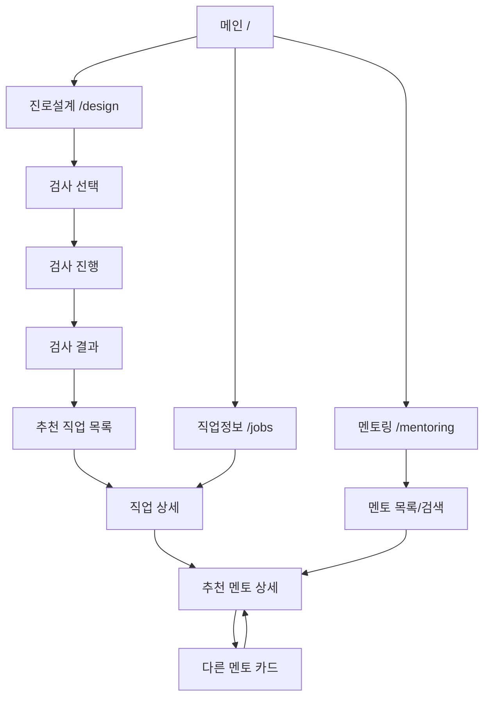
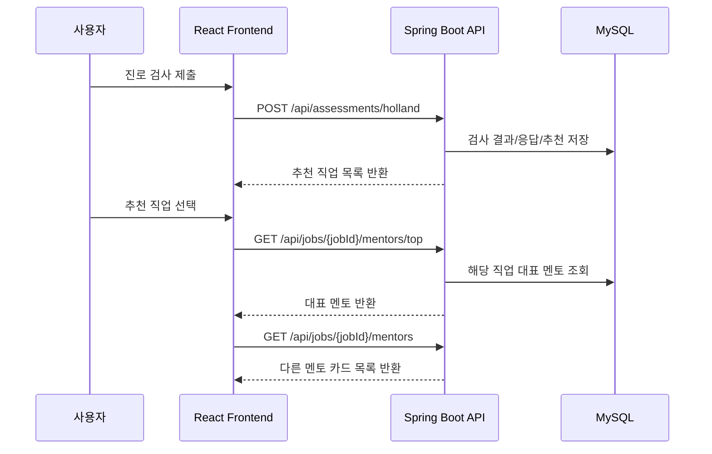

# CareerNet 페이지 흐름 설계

## 서비스 의도

CareerNet은 사용자가 자기 성향을 검사하고, 그 결과에 맞는 직업을 탐색한 뒤, 실제 실무자 멘토와 연결되는 흐름을 목표로 합니다.

핵심 경험은 아래 한 줄입니다.

```text
나를 이해한다 → 맞는 직업을 찾는다 → 실제 실무자를 만난다
```

## 전체 사용자 흐름



## 현재 프론트 라우트와 목표 라우트

| 현재 라우트 | 현재 역할 | 목표 역할 |
| --- | --- | --- |
| `/` | 메인 | 진로설계, 직업정보, 멘토링 진입 |
| `/design` | 진로검사 | 검사 선택, 진행, 결과, 추천 직업 |
| `/jobs` | 직업정보 | 직업 목록/검색/카테고리 |
| `/jobs/:jobId` | 직업상세 | 직업 설명, 역량, 로드맵, 관련 멘토 |
| `/mentoring` | 멘토링 | 멘토 목록/검색 |
| 신규 `/mentoring/:mentorId` | 없음 | 멘토 상세 페이지 |
| 신규 `/assessments/:assessmentId/result` | 없음 | 저장된 검사 결과 재조회 |

## 1. 진로설계 진입 흐름

### 목적

사용자가 검사를 통해 자신의 성향을 파악하고, 적합한 직업 추천을 받습니다.

### 화면 흐름

```text
/design
→ 검사 선택
→ 검사 문항 진행
→ 결과 분석
→ 추천 직업 목록
→ 직업 선택
→ 직업 상세 또는 멘토 상세
```

### 데이터 흐름

```text
프론트 검사 답변
→ POST /api/assessments/holland
→ assessment_result 저장
→ assessment_answer 저장
→ assessment_recommendation 저장
→ 추천 직업 목록 응답
```

### 응답 예시

```json
{
  "assessmentId": 1,
  "hollandCode": "IRC",
  "primaryType": "I",
  "recommendations": [
    {
      "jobId": 1,
      "jobCode": "ai-engineer",
      "title": "AI 엔지니어",
      "matchScore": 92,
      "matchLabel": "매우 적합"
    }
  ]
}
```

## 2. 직업정보 페이지 흐름

### 목적

검사 없이도 사용자가 다양한 직업 정보를 탐색할 수 있게 합니다.

### 화면 흐름

```text
/jobs
→ 직업 목록
→ 카테고리/검색/정렬
→ 직업 상세 /jobs/:jobId
→ 관련 멘토 카드
```

### 필요한 API

```text
GET /api/jobs
GET /api/jobs/{jobId}
GET /api/jobs/{jobId}/mentors
```

### 직업 상세에서 보여줄 정보

- 직업명
- 짧은 설명
- 상세 설명
- 필요 역량
- 준비 로드맵
- 평균 연봉
- 전망
- 관련 Holland 유형
- 관련 멘토 목록

## 3. 멘토링 페이지 흐름

멘토링 페이지는 두 가지 진입 경로가 있습니다.

## 3-1. 진로설계 결과에서 진입

### 목적

검사 후 추천 직업을 선택했을 때, 해당 직업과 가장 관련 있는 실무자를 먼저 보여줍니다.

### 화면 흐름

```text
검사 결과
→ 추천 직업 선택
→ 해당 직업의 대표 멘토 상세
→ 하단 다른 멘토 카드 추천
```

### 대표 멘토 선정 기준

```text
1. 해당 job_id와 연결된 멘토
2. recommendation_count가 가장 높은 멘토
3. priority가 높은 멘토
4. recommendation_weight가 높은 멘토
```

### 필요한 API

```text
GET /api/jobs/{jobId}/mentors/top
GET /api/jobs/{jobId}/mentors
GET /api/mentors/{mentorId}
```

## 3-2. 멘토링 메뉴에서 직접 진입

### 목적

사용자가 직업 추천 흐름을 거치지 않아도 멘토를 직접 탐색할 수 있게 합니다.

### 화면 흐름

```text
/mentoring
→ 멘토 목록
→ 직업/분야/키워드 검색
→ 멘토 카드 선택
→ /mentoring/:mentorId
```

### 필요한 API

```text
GET /api/mentors
GET /api/mentors/{mentorId}
```

## 4. 멘토 상세 페이지 구성

사용자가 예시로 준 CareerNet 인터뷰 페이지처럼, 멘토 상세는 단순 카드가 아니라 실무자 인터뷰형 페이지가 적합합니다.

### 화면 구성

```text
상단
- 멘토 이름
- 직무
- 회사/기관
- 대표 이미지
- 한 줄 소개

본문
- 직무 소개
- 실제 하는 일
- 하루 업무 흐름
- 필요한 역량
- 진로 준비 조언
- 학생에게 해주고 싶은 말

하단
- 같은 직업의 다른 멘토 카드
- 비슷한 직업의 멘토 카드
- 멘토링 신청 버튼
```

### 멘토 카드 구성

```text
멘토 이름
직무/회사
추천수
한 줄 설명
짧은 설명
```

예시:

```text
재정 고민을 숫자로 풀어주는 전문가
세금의 신고와 납부 대행, 회계 관리 지원 및 전략 제시 등의 업무를 수행합니다.
```

## 5. 백엔드 API 흐름



## 6. 구현 순서 제안

한 번에 전체를 구현하면 검사/직업/멘토 연결이 어긋날 가능성이 큽니다.

권장 순서는 아래와 같습니다.

```text
1. MySQL DDL 확정
2. 백엔드 Entity/Repository/Service/API 구성
3. 직업/멘토 seed 데이터 입력
4. 프론트 mock 데이터를 API 호출로 교체
5. 진로설계 결과 → 직업 추천 → 멘토 상세 연결
6. 멘토링 직접 진입 페이지 구성
7. 검색/필터/추천 정렬 고도화
```

## 7. 프론트에서 바뀔 가능성이 큰 파일

현재 프론트 구조를 기준으로, 이후 실제 API 연결 시 수정 가능성이 큰 파일입니다.

```text
frontend/src/context/Useauth.jsx
frontend/src/pages/CareerDesign.jsx
frontend/src/components/career/Multiassessmentrunner.jsx
frontend/src/components/career/Multiresultstep.jsx
frontend/src/components/career/Jobdetailstep.jsx
frontend/src/pages/JobInfo.jsx
frontend/src/pages/JobDetail.jsx
frontend/src/pages/Mentoring.jsx
frontend/src/App.jsx
```

## 8. 이번 단계에서 확정할 것

다음 구현으로 넘어가기 전에 아래 항목은 확정하는 것이 좋습니다.

```text
1. 사용자 로그인/회원가입을 먼저 구현할지
2. 비로그인 사용자도 검사를 저장할지
3. 멘토링 신청 기능까지 넣을지, 우선 멘토 상세 조회까지만 할지
4. 직업 데이터와 멘토 데이터를 seed SQL로 넣을지
5. 기존 프론트 JobDatabase.js 데이터를 MySQL seed로 이전할지
```
